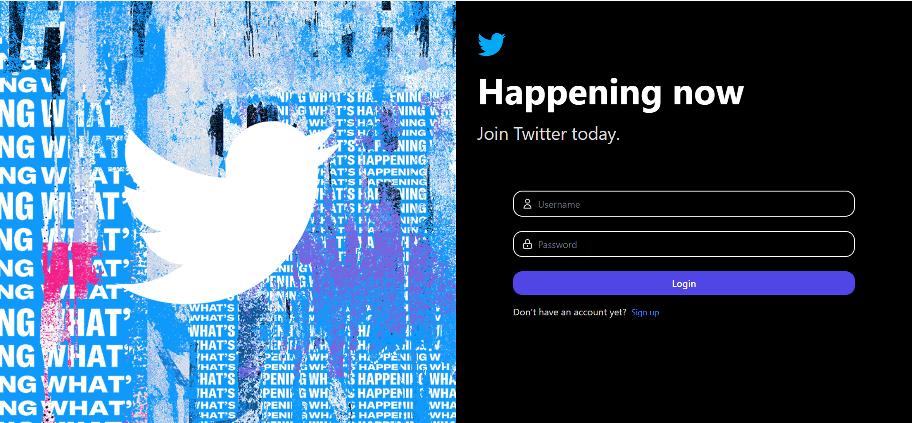
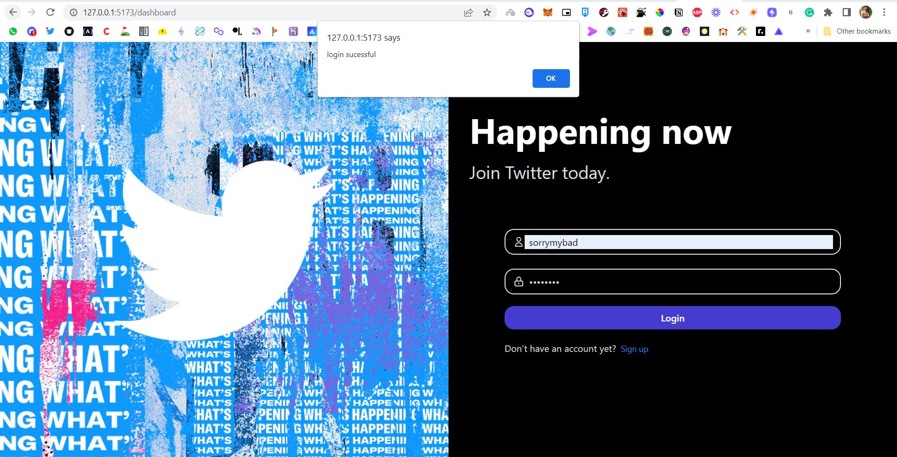
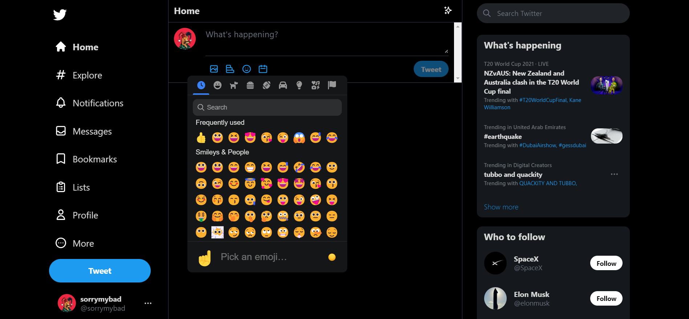
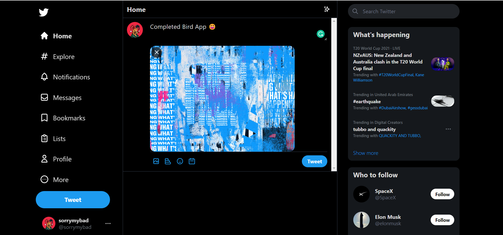
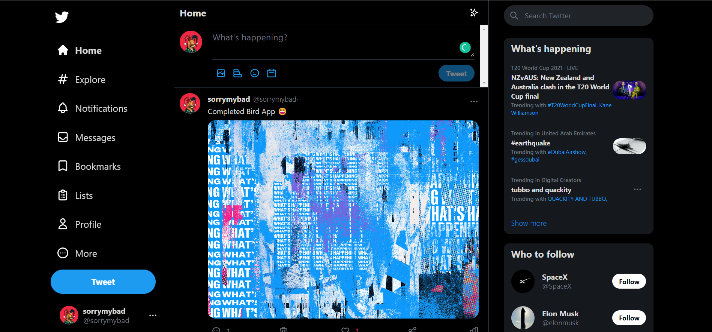
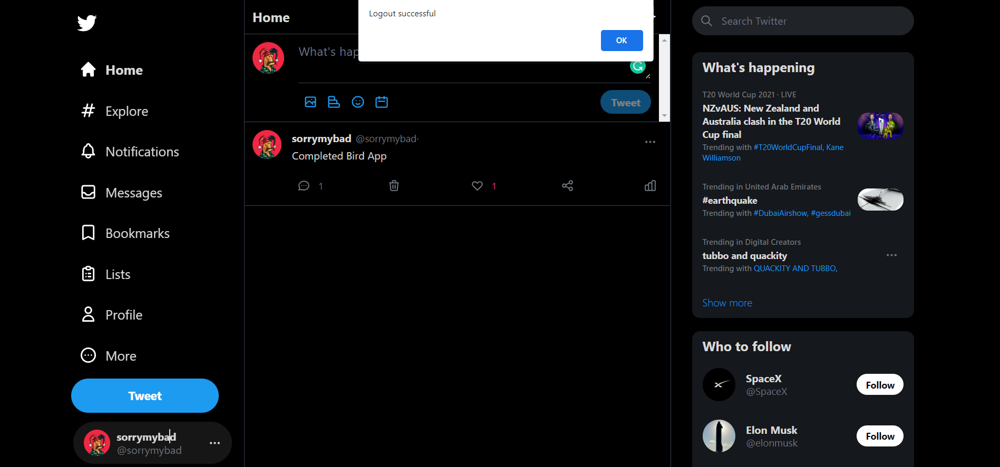
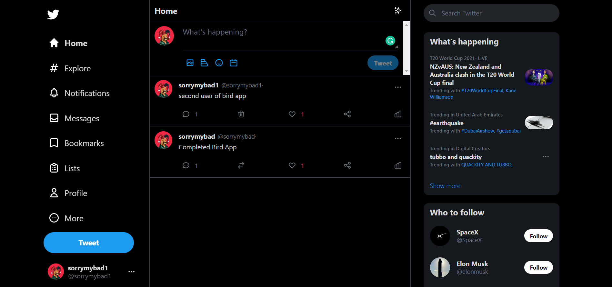
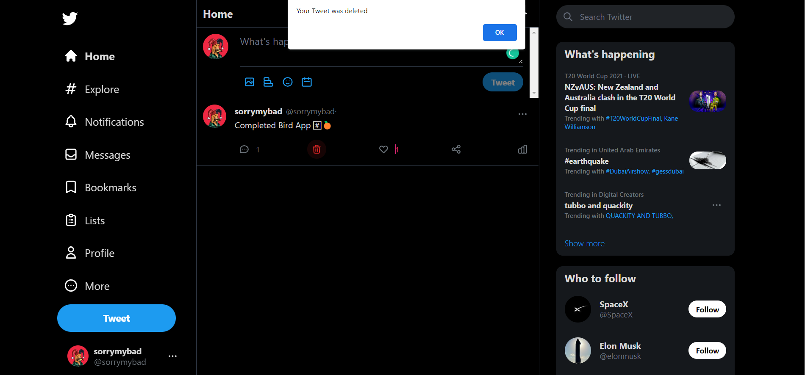
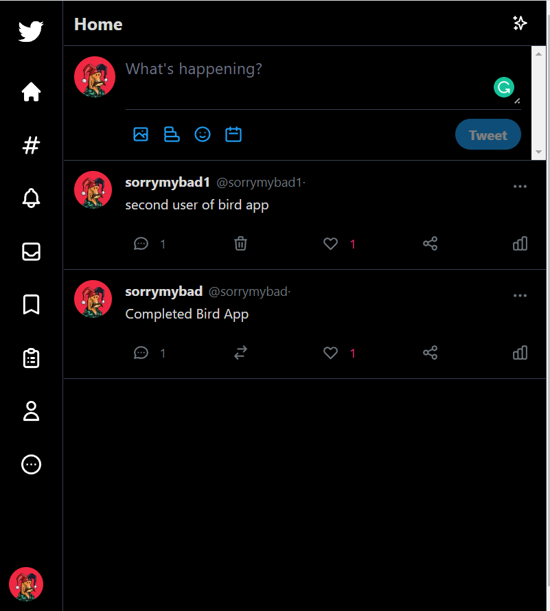

# BirdApp

The Bird app is a Twitter clone created using React and Tailwind CSS. This project taught me more about React useeffects, fetch, components, routers, and useRef.

# Demo:

### signup

### Login success

### Emoji 

### Image upload

### Dashboard 

### Log out

### multiple user 

### Delete Post

### Responsive

